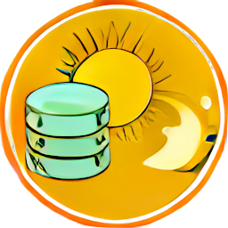

<!-- use sgmlproc for generating a html file -->

# daylight_status

is a simple Linux bash script that stores the 2 states 'day' and 'night' 
in a round-robin database. It is intended for coloring the background of 
RRDtool graphs.

This script
- either stores data into a local round-robin database using RRDtool-commands.
- or stores data into a remote round-robin database using RRDTool_API.

Website of RRDtool: https://oss.oetiker.ch/rrdtool/

## Requirements

Linux, Python 3 and either RRDtool or RRDTool_API.

## Installation

The included installation script is designed for a Debian-based Linux, 
such as Raspberry Pi OS and Ubuntu.
For other operating systems, the commands must be adapted accordingly.

#### Proceeding

* Put the packet on any place of your choice. 
* Create a local or remote round-robin database.
* Run script **00_install_daylight_status.bash**
* Adjust the settings in the **./settings** file to your requirements.
* Start script **daylight_status.bash**.

## Settings

Important settings (file **./settings**):
* coordinates for sunset/ sunrise
* data for database access

## Start - Stop daylight_status.bash

To get the commands run script **11_get_procid.bash**.

## Uninstallation

* Stop script **daylight_status.bash**.
* Run script **99_do_removes.bash**.
* Delete packet folder.

You can also delete the software mentioned in **00_install_daylight_status.bash**, if no other program is using it.

## License: MIT

Copyright © 2022 piet66

Permission is hereby granted, free of charge, to any person obtaining a copy 
of this software and associated documentation files (the "Software"), to deal 
in the Software without restriction, including without limitation the rights 
to use, copy, modify, merge, publish, distribute, sublicense, and/or sell 
copies of the Software, and to permit persons to whom the Software is furnished 
to do so, subject to the following conditions:

The above copyright notice and this permission notice shall be included in all 
copies or substantial portions of the Software.

THE SOFTWARE IS PROVIDED "AS IS", WITHOUT WARRANTY OF ANY KIND, EXPRESS OR 
IMPLIED, INCLUDING BUT NOT LIMITED TO THE WARRANTIES OF MERCHANTABILITY, 
FITNESS FOR A PARTICULAR PURPOSE AND NONINFRINGEMENT. IN NO EVENT SHALL 
THE AUTHORS OR COPYRIGHT HOLDERS BE LIABLE FOR ANY CLAIM, DAMAGES OR OTHER 
LIABILITY, WHETHER IN AN ACTION OF CONTRACT, TORT OR OTHERWISE, ARISING FROM, 
OUT OF OR IN CONNECTION WITH THE SOFTWARE OR THE USE OR OTHER DEALINGS IN THE 
SOFTWARE.

